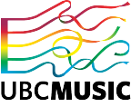
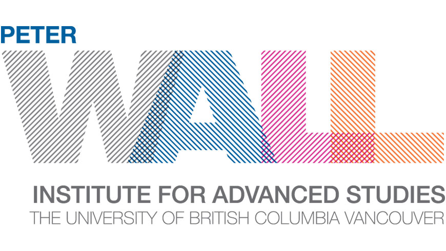
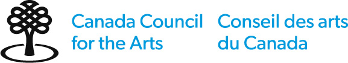

### Exhibition

*‘slippages’*  website was a collaborative effort involving colleagues from across multiple departmental units:
* UBC Library Music, Art and Architecture Library: Kevin Madill (UBC Music Librarian), Matthew Kaufhold (Graduate Academic Assistant, UBC School of Information).
*	UBC Library Digital Initiatives: Robert Stibravy (Librarian, Digital Projects), Eirian Vining (Digital Project Librarian), Stephanie Savage (Scholarly Communications and Copyright).
*	UBC Library Research Commons: Eka Grguric (Digital Scholarship Librarian), Evan Thornberry (GIS Librarian).
*	UBC Library Rare Books and Special Collections: Krisztina Laszlo (Archivist), Felicia de la Para (Senior Library Assistant), Natalie Trapuzzano (Archives Assistant).
*	UBC Library Woodward Library: Helen Brown (Subject Librarian).
*	cIRcle: Tara Stephens-Kyte (Digital Repository Librarian).

Three colleagues in particular deserve independent acknowledgement for their project contributions:
*	Eka Grguric for guiding the construction of the website and providing effective solutions to project complications as they arose.
* Evan Thornberry for collecting and navigating geographically referenced project data and images and for thoughtful feedback throughout website construction.
*	Matthew Kaufhold for serving as the primary digitizer, creating resource metadata, participating in website construction, and editing website content.

UBC School of Music graciously extended support to *‘slippages’*  website creation by way of facilitating performance copyright clearance. Special thanks goes to UBC Director of Orchestras Dr. Jonathan Girard whose boundless energy and kindness contributed greatly to the success of the enterprise.

Photographer John William kindly granted permission for use of his images documenting composer and conductor in the collaborative/creative process.

Lastly we thank composer and artist, Deborah Carruthers, for giving generously of her time, energy, and commitment to the success of the venture. Thank you, Deborah.

### Funding

Funding for the project *‘slippages’*  was provided by The Peter Wall Institute for Advanced Studies, the Canada Council of the Arts, and the Anne Kaplan Endowment, UBC Library.

Funding for the website *‘slippages’*  and digitization of *‘slippages’*  resources was provided by the Anne Kaplan Endowment, UBC Library.

  

    

   

   

  

 

### Site

This site is built using Wax, a minimal computing ([minicomp](https://github.com/minicomp)) project led by [Marii Nyröp](http://marii.info/) and currently maintained by Marii Nyrop and [Alex Gil](https://github.com/elotroalex) at Columbia University Libraries.

Wax uses open source libraries and frameworks (including [Jekyll](https://jekyllrb.com/), [IIIF](https://iiif.io/), [OpenSeaDragon](https://openseadragon.github.io/), [Rake](https://ruby.github.io/rake/), and [ElasticLunr](http://elasticlunr.com/)) and builds upon work by software and data architects [Peter Binkley](https://github.com/pbinkley), [David Newbury](https://github.com/workergnome), and others.

[Affiliations](https://ubc-ds.github.io/slippages/affiliations)
